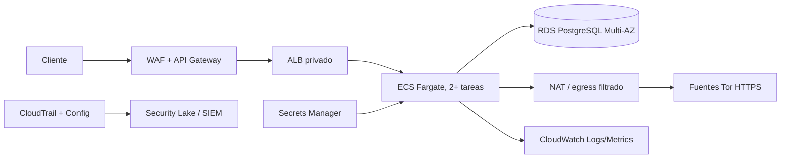

# Despliegue de referencia en AWS

## Arquitectura

La imagen se publica en ECR con tag inmutable y firma. ECS Fargate ejecuta al menos dos
tareas en subredes privadas, usuario no root, filesystem de sólo lectura y sin capacidades.
API Gateway aplica cuota y WAF; el ALB sólo acepta tráfico de API Gateway. RDS PostgreSQL
Multi-AZ reemplaza SQLite en producción y cifra con KMS. Security Groups permiten salida
HTTPS únicamente mediante proxy/NAT con allowlist para las fuentes.

## Adaptaciones de aplicación

1. Implementar el repositorio de exclusiones con PostgreSQL y migraciones versionadas.
2. Guardar API keys en Secrets Manager o, preferiblemente, sustituirlas por JWT de Cognito
   con scopes `tor:read` y `exclusions:write`.
3. Mover la caché a ElastiCache o S3 para compartir snapshots entre tareas.
4. Ejecutar refresh en EventBridge + tarea ECS; la API sirve el último snapshot validado.
5. Enviar auditoría a un stream append-only; no depender sólo de la base operacional.

## Entrega y operación

- Pipeline: tests, Ruff, SAST (CodeQL/Bandit), SCA, build, escaneo de ECR, SBOM, firma,
  despliegue canario y smoke test.
- IaC con Terraform/CDK; roles IAM mínimos y separados para tarea, pipeline y operador.
- Alarmas por tasa 5xx, edad del snapshot, cero IPs, fuente fallida, latencia, cambios de
  exclusiones y denegaciones de autenticación.
- Backups automáticos, PITR, prueba de restauración, rotación de secretos y runbook para
  fuente comprometida.
- Objetivo de disponibilidad multi-AZ; si todas las fuentes fallan, servir snapshot previo
  marcado `stale=true` y alertar. Nunca sustituirlo por lista vacía silenciosa.
